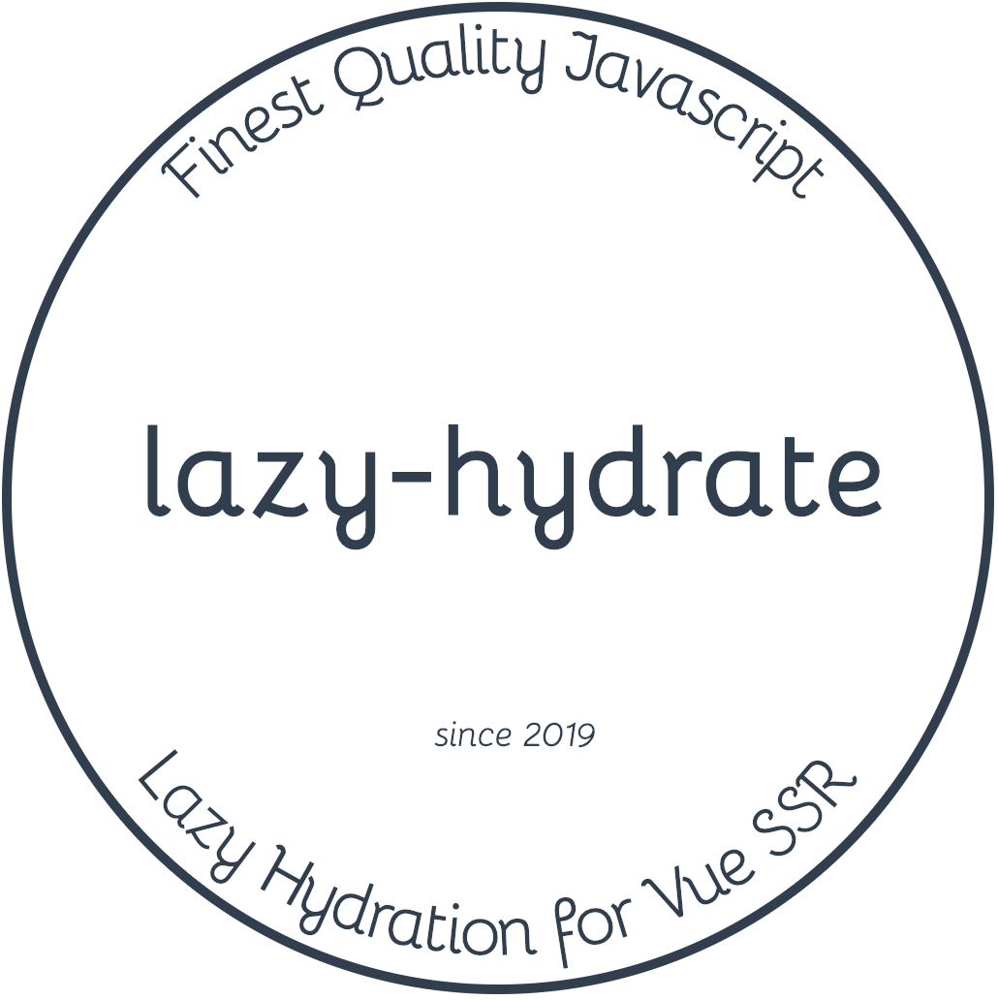

<div class="text-xs-center" align="center" style="margin: 20px">
  
</div><br><br>

<div class="text-xs-center" align="center">

  [](https://vuejs.org/)
  [](https://npmjs.com/package/lazy-hydration)
  [](https://npmjs.com/package/lazy-hydration)

</div>

## Introduction

Lazy hydration for Vue SSR.

> NOTE: This project uses [@znck/prop-types](https://github.com/znck/prop-types) which generates tree shakeable component prop definitions but it requires `process.env.NODE_ENV` to replaced with `"production"` to work effectively. See [@znck/prop-types](https://github.com/znck/prop-types#introduction)'s documentation to know more.

## Usage

### Installation

```shell
npm install --save lazy-hydration
```

### Examples

```js
import Hydrate from 'lazy-hydration';

export default {
  ...
  components: { Hydrate }
  ...
}
```

Examples of using Hydrate in a Vue component, which also
documents the different options provided:

```html
<template>
  <div>
    <!-- Hydrate when user clicks. -->
    <Hydrate on-click>
      <MyComponent />
      <MyComponent />
      <MyComponent />
    </Hydrate>

    <!-- Just in time hydration. When user hovers over content -->
    <Hydrate on-hover>
      ...
    </Hydrate>

    <!-- Hydrate on any event -->
    <Hydrate on="fullscreen">
      ...
    </Hydrate>

    <!-- or events -->
    <Hydrate :on="['fullscreen', 'mousedown']">
      ...
    </Hydrate>

    <!-- When user hover over or keyboard focus into. -->
    <Hydrate on-interaction>
      ...
    </Hydrate>

    <!-- Requires IntersectionObserver. Polyfill not included. -->
    <Hydrate when-visible>
      ...
    </Hydrate>

    <!-- Requires requestIdleCallback. Polyfill not included. -->
    <Hydrate when-idle>
      ...
    </Hydrate>

    <!-- Only in SSR. -->
    <Hydrate ssr-only>
      ...
    </Hydrate>

    <!-- Scheduled hydration. In 2s of initial render. -->
    <Hydrate :with-delay="2000">
      ...
    </Hydrate>

    <!-- Controlled hydration -->
    <Hydrate :force="isItReady">
      ...
    </Hydrate>
  </div>
</template>
```

Programmatic approach:

``` html
<template>
  <Hydrate ref="child">
    ...
  </Hydrate>
</template>

<script>
export default {
  methods: {
    foo() {
      this.$refs.child.hydrate()
    }
  }
}
</script>
```

> **NOTE:** Consider BETA until v1.0 release.

## Prior Art

- [vue-lazy-hydration](https://github.com/maoberlehner/vue-lazy-hydration) by Markus Oberlehner

## Contributing

Please read [CONTRIBUTING.md](CONTRIBUTING.md) for details on our code of conduct, and the process for submitting pull requests to us.

## Versioning

We use [SemVer](http://semver.org/) for versioning. For the versions available, see the [tags on this repository](https://github.com/znck/lazy-hydration/releases).

## Author

**lazy-hydration** © [Rahul Kadyan](https://github.com/znck), Released under the [MIT](./LICENSE) License.<br>
Authored and maintained by Rahul Kadyan with help from contributors ([list](https://github.com/znck/lazy-hydration-temp/contributors)).

> [znck.me](https://znck.me) · GitHub [@Rahul Kadyan](https://github.com/znck) · Twitter [@znck0](https://twitter.com/@znck0)
