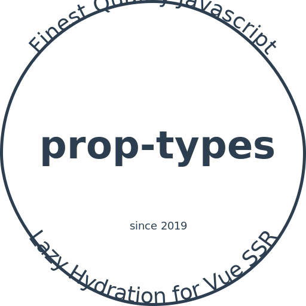

<div class="text-xs-center" align="center" style="margin: 20px">
  
</div><br><br>

<div class="text-xs-center" align="center">

  [](https://vuejs.org/)
  [](https://npmjs.com/package/lazy-hydration)
  [](https://npmjs.com/package/lazy-hydration)

</div>

## Introduction

Lazy hydration for Vue SSR.


## Usage

### Installation

```shell
npm install --save lazy-hydration
```

### Examples

```js
import Hydrate from 'lazy-hydration';

export default {
  ...
  components: { Hydrate }
  ...
}
```

Examples of using Hydrate in a Vue component, which also
documents the different options provided:

```html
<template>
  <div>
    <Hydrate on-click>
      <MyComponent />
      <MyComponent />
      <MyComponent />
    </Hydrate>

    <Hydrate on-hover>
      ...
    </Hydrate>

    <!-- When user hover over or keyboard focus into. -->
    <Hydrate on-interaction>
      ...
    </Hydrate>

    <!-- Requires IntersectionObserver. Polyfill not included. -->
    <Hydrate when-visible>
      ...
    </Hydrate>

    <!-- Requires requestIdleCallback. Polyfill not included. -->
    <Hydrate when-idle>
      ...
    </Hydrate>
  </div>
</template>
```

## Contributing

Please read [CONTRIBUTING.md](CONTRIBUTING.md) for details on our code of conduct, and the process for submitting pull requests to us.

## Versioning

We use [SemVer](http://semver.org/) for versioning. For the versions available, see the [tags on this repository](https://github.com/znck/lazy-hydration/releases).

## Author

**lazy-hydration** © [Rahul Kadyan](https://github.com/znck), Released under the [MIT](./LICENSE) License.<br>
Authored and maintained by Rahul Kadyan with help from contributors ([list](https://github.com/znck/lazy-hydration-temp/contributors)).

> [znck.me](https://znck.me) · GitHub [@Rahul Kadyan](https://github.com/znck) · Twitter [@znck0](https://twitter.com/@znck0)
